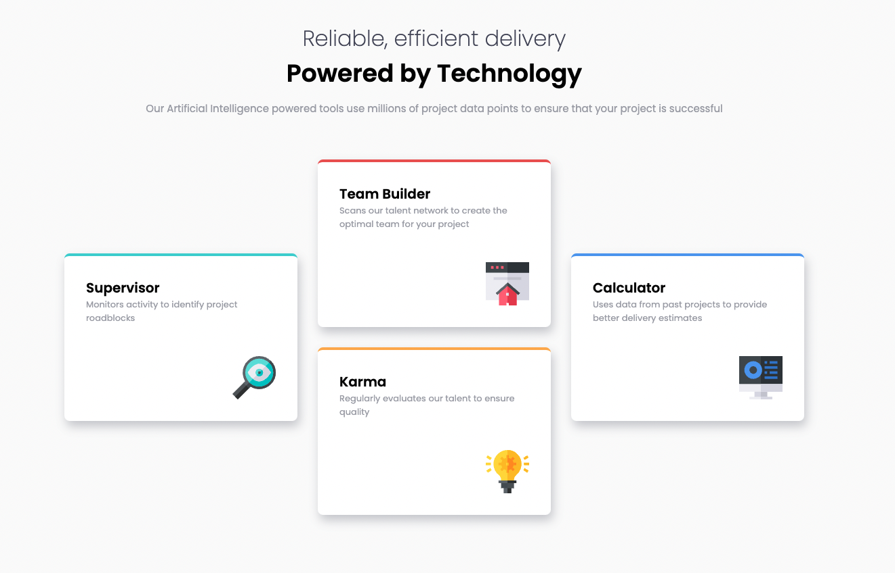
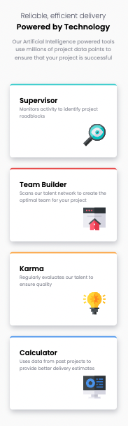

# Frontend Mentor - Four card feature section solution

This is a solution to the [Four card feature section challenge on Frontend Mentor](https://www.frontendmentor.io/challenges/four-card-feature-section-weK1eFYK). Frontend Mentor challenges help you improve your coding skills by building realistic projects.

## Table of contents

- [Overview](#overview)
  - [The challenge](#the-challenge)
  - [Screenshot](#screenshot)
  - [Links](#links)
- [My process](#my-process)
  - [Built with](#built-with)
  - [What I learned](#what-i-learned)
  - [Continued development](#continued-development)
  - [Useful resources](#useful-resources)
- [Author](#author)
- [Acknowledgments](#acknowledgments)

**Note: Delete this note and update the table of contents based on what sections you keep.**

## Overview

### The challenge

Users should be able to:

- View the optimal layout for the site depending on their device's screen size

### Screenshot

Desktop


Mobile


### Links

- [solution url]: (https://github.com/ponhuang/4-cards-feature)
- [live site url]: (https://ponhuang.github.io/4-cards-feature/)

## My process

### Built with

- Semantic HTML5 markup
- CSS custom properties
- Flexbox
- CSS Grid
- Desktop-first workflow

### What I learned

Apply what I have learned yesterday, and see how it works on this challenge.

```css
header {
  width: min(80%, 45rem);
  margin-inline: auto;
}
```

### Continued development

## Author

Pon Huang

- Instagram - [Pon Huang](https://www.instagram.com/ponhuang/)
- Art Blog - [une felt](https://une722.wordpress.com)

## Acknowledgments
